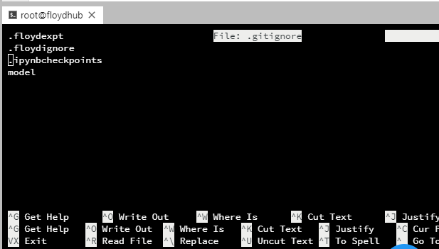

## Tips and Tricks

### Converting a Jupyter Notebook into a Python script

Run this command in your terminal. 
```
jupyter nbconvert --to script <filename>.ipynb
```


### Pasting text in a Workspace terminal

You can paste text in your clipboard into a terminal using the `Ctrl + Shift + V` shortcut key.

The following *don't* work:
- Right click -> Paste
- `Ctrl + V`

### Diff-ing Notebooks inside Workspace

If you have multiple versions of Notebooks, you can go an _intelligent_ diff on the content (rather than the raw JSON) using the 
(nbdime plugin)[https://nbdime.readthedocs.io/en/stable/].

Instructions:
Run the following commands inside your Workspace console
```
pip install nbdime
nbdiff <file>.ipynb <file2>.ipynb
```


### Collapsing large Notebook cell output

You can collapse cell outputs by clicking on the blue bar on the left


### Parsing command line arguments in Python scripts

Use the `argparse` library. 

Example:
```
import os
from argparse import ArgumentParser

def build_parser():
    parser = ArgumentParser()
    
    # Attributes: Required argument, type=string
    parser.add_argument('--checkpoint-dir', type=str,
                        dest='checkpoint_dir', help='dir to save checkpoint in',
                        required=True)
    
    # Attributes: Optional argument, type=string
    parser.add_argument('--train-path', type=str,
                        dest='train_path', help='path to training images folder',
                        default='/floyd/input/train')
    
    # Attributes: boolean variable
    parser.add_argument('--slow', dest='slow', action='store_true',
                        help='gatys\' approach (for debugging, not supported)',
                        default=False)
    
    # Attributes: int variable, with default value
    parser.add_argument('--epochs', type=int,
                        dest='epochs', help='num epochs',
                        default=100)
    
    # Attributes: float variable, with default value
    parser.add_argument('--content-weight', type=float,
                        dest='content_weight',
                        help='content weight (default %(default)s)',
                        default=0.75)
    
    return parser

def check_opts(opts):
    assert os.path.exists(opts.checkpoint_dir), "checkpoint dir not found!"
    assert opts.epochs > 0
    
def main():
    parser = build_parser()
    options = parser.parse_args()
    check_opts(options)
    print("Num epochs: ", options.epochs)
```

View the complete API of the [add_argument](https://docs.python.org/3/library/argparse.html#the-add-argument-method) method


### To check in your Workspace code to a **new** Git repo

```
git init
git config user.name "ENTER_USERNAME"
git config user.email "ENTER_EMAIL"
git add .
git commit -m "First commit"
# Create a new repo on Github: https://help.github.com/articles/creating-a-new-repository/
git remote add origin <<URL>> # Replace URL with your git URL (e.g. https://github.com/floydhub/mnist-demo.git)
git push origin master
# Enter your username and password. NOTE: If you have 2-factor auth (2FA) enabled on GitHub, you need to use a personal access token (https://github.com/settings/tokens) instead of a password.
```

#### Use `.gitignore` to ignore files you don't want to check in

FloydHub automatically creates a `.gitignore` file for you. If you have files that you don't want to check in (e.g. data, models, Jupyter Notebook checkpoints, etc.), you can add them to it.

Note: `.gitignore` is a hidden file. You can open it from your Workspace Terminal using the `nano` terminal editor command.

```
root@floydhub:/floyd/home#  nano .gitignore
```



